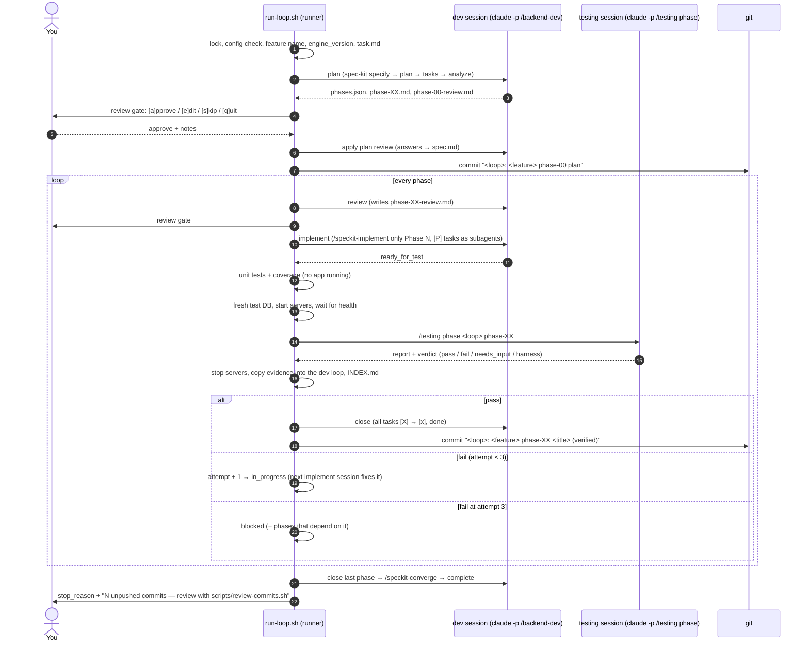
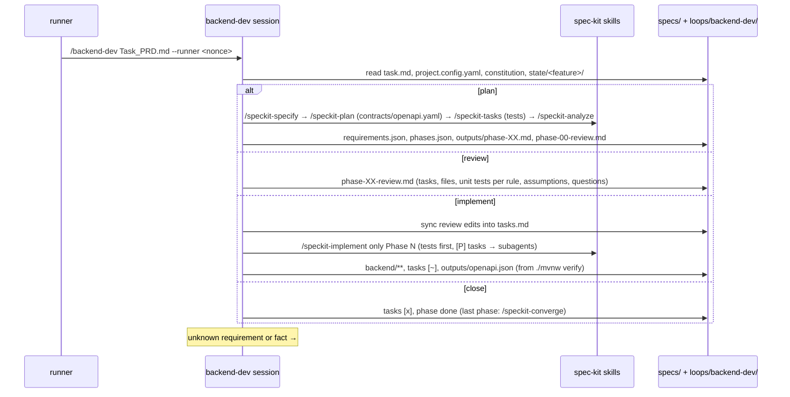
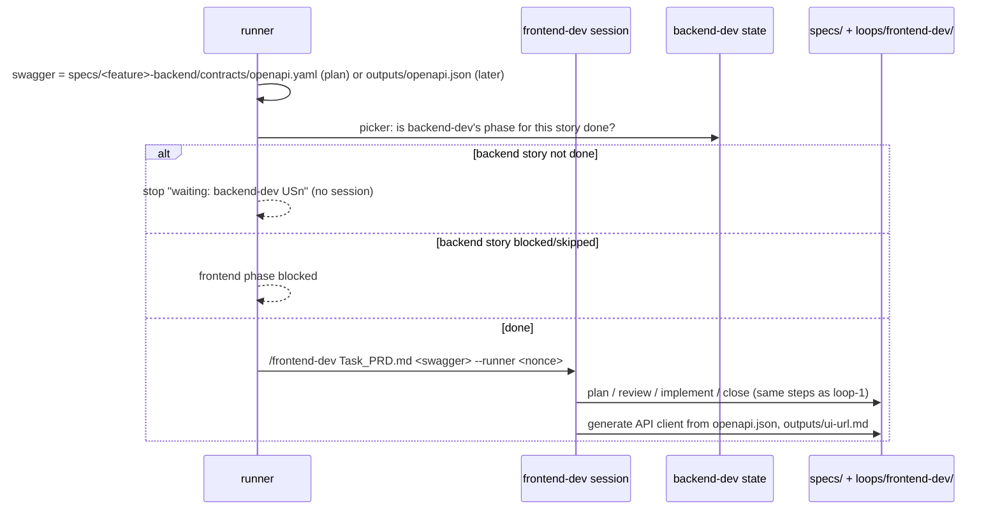
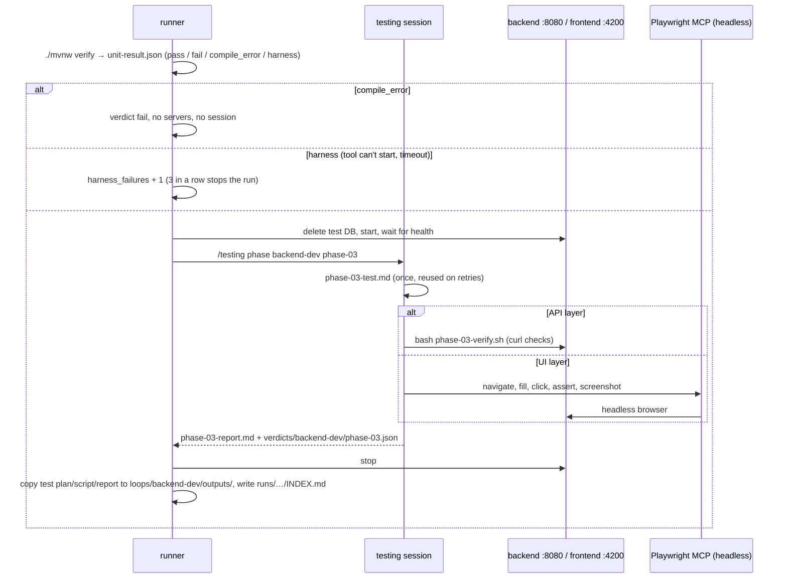
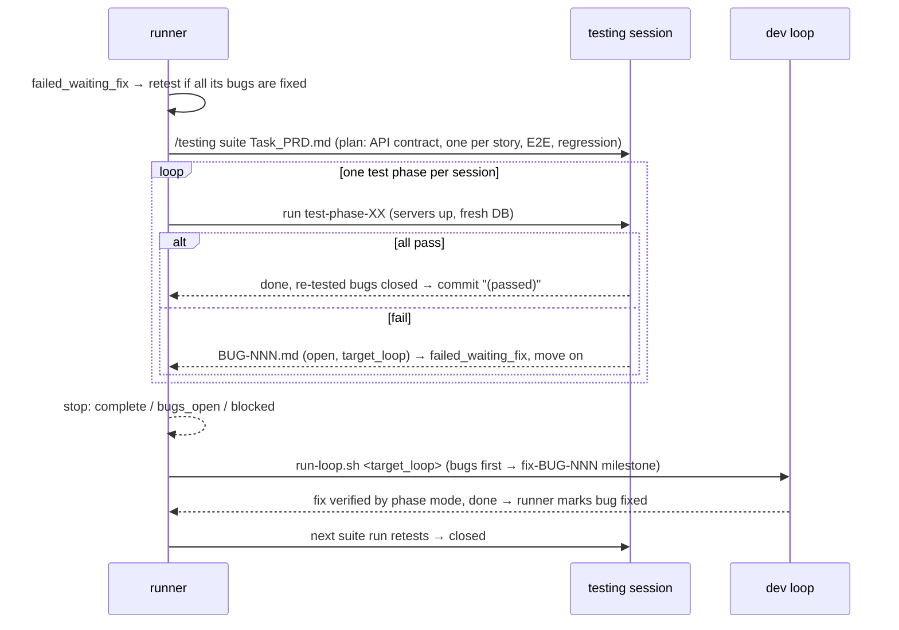
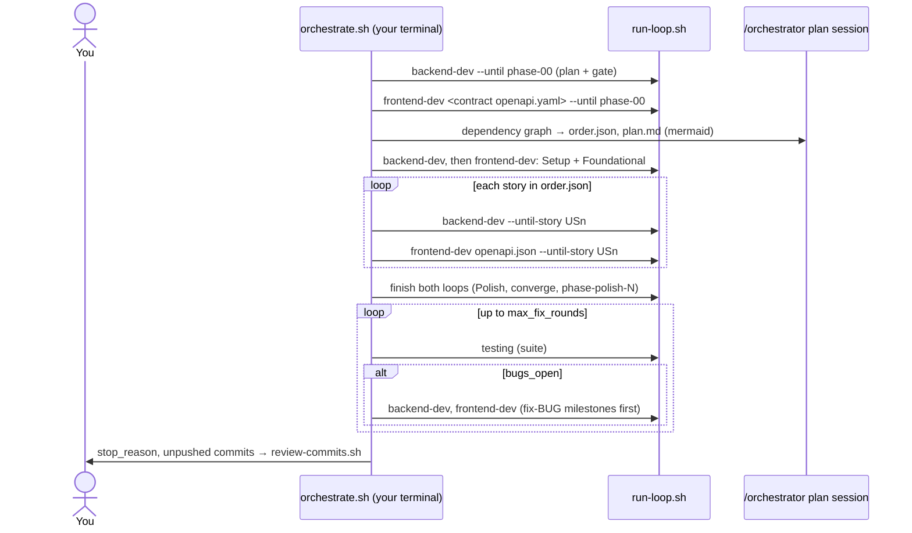

# QuickFlow, built by reusable Claude Loops

Four **Claude Loops** plan, build and verify an application from a requirements file — a full PRD
or a single user story:

| Loop | Input | Does | Verifies with |
|---|---|---|---|
| **loop-1 `backend-dev`** | PRD / US | plans phases (spec-kit), writes the API + swagger, unit tests first | — (never itself) |
| **loop-2 `frontend-dev`** | PRD / US + backend swagger | plans phases, writes the UI from a generated API client | — (never itself) |
| **loop-3 `testing`** | a dev phase, or PRD / US | `phase` mode: the gate for each dev phase · `suite` mode: its own test phases + bug reports | curl (API), Playwright MCP headless (UI), unit + coverage reports |
| **`orchestrator`** | PRD / US | orders the stories across layers (dependency graph) | — |

Every loop has `Loop-instructions.md`, `task.md`, `progress.md`, `state/`, `outputs/` (and `runs/`),
a `## Stop condition` ("milestone complete, or 3 attempts"), and works on any stack: everything
project-specific is in [`project.config.yaml`](project.config.yaml).

The app: **QuickFlow** ([`Task_PRD.md`](Task_PRD.md)) — Spring Boot 4.1.1 / Java 25 backend,
Angular 22.2 frontend.

## Quick start

Prerequisites: JDK 25 with the compiler (`javac`; on Fedora `java-25-openjdk-devel`, not only the runtime), Node 24 (≥ 24.15), Claude Code (`claude`), `uv`, `git`, `jq`, `flock`,
Python 3 with `pyyaml` (and `openpyxl` for the Excel export).

```bash
# one-time setup
git config core.hooksPath .githooks                       # pushes only through review-commits.sh
uvx --from git+https://github.com/github/spec-kit.git@v1.0.11 specify init . --integration claude --script sh
npx -y playwright@1.64.0-alpha-1789764292000 install chromium   # the browser @playwright/mcp@0.0.82 uses
claude   # then, interactively: /speckit-constitution (generated from project.config.yaml)
git add -A && git commit -m "engine"                      # the runner refuses to run an uncommitted engine
```

| Run | With review gates (default) | Unattended |
|---|---|---|
| Everything, one story at a time | `scripts/orchestrate.sh Task_PRD.md` | `scripts/orchestrate.sh Task_PRD.md --auto-approve` |
| loop-1 only | `scripts/run-loop.sh backend-dev Task_PRD.md` | `… --auto-approve` |
| loop-2 only | `scripts/run-loop.sh frontend-dev Task_PRD.md` | `… --auto-approve` |
| loop-3 suite | `scripts/run-loop.sh testing Task_PRD.md` | `… --auto-approve` |
| A single user story | `scripts/orchestrate.sh examples/single-us/US-tags.md` (or each `run-loop.sh` directly) | `… --auto-approve` |
| Review commits and push | `scripts/review-commits.sh` | — (always you) |

Run these **in your own terminal**: the review gate prompts you and opens `$EDITOR`. Typing a loop's
slash command (`/backend-dev Task_PRD.md`) in Claude Code changes nothing and only prints the
command to run. Other flags: `--until phase-03`, `--until-story US3`, `--unblock phase-06`,
`--allow-dirty-engine` (dry-run worktrees only).

## How a run works



After **every** session the runner runs the **guard** (only allowed paths and allowed status moves;
anything else is restored and stops the run), appends one row to `docs/sessions.csv` and rebuilds the
milestone table in each `progress.md`.

### loop-1 `backend-dev`



### loop-2 `frontend-dev`



### loop-3 `testing`, phase mode (the gate for every dev phase)



### loop-3 `testing`, suite mode (with the bug hand-off)



### orchestrator



## Why a runner, not `/loop`
Claude Code's built-in `/loop` re-runs a prompt inside one session. These loops need a **fresh session
for every step** (its own session id and token count, small context, state on disk), the **review
gate in your terminal**, and **servers, unit tests and commits handled outside Claude**. So a bash
runner drives them; each loop skill still does exactly one step per call, which is one loop iteration.

## Why testing is its own loop
The dev loops never mark their own work as verified. The testing loop writes its checks from the
acceptance criteria and the swagger, not from the dev loop's code, and it can't change application
code (permissions + guard). The task's wording still holds: every backend phase is tested with curl
and every frontend phase with Playwright MCP as soon as it is built, and the runner copies the test
plan, the curl script and the report into `loops/backend-dev/outputs/` and
`loops/frontend-dev/outputs/`, with an `INDEX.md` per attempt in their `runs/` linking to the
screenshots, curl logs and unit/coverage reports.

## Review & push
Two human checkpoints:
1. **Before each phase** is implemented: the dev loop writes `phase-XX-review.md` (plan, files, unit
   tests, risks, assumptions, questions) and the runner waits for `[a]pprove / [e]dit / [s]kip / [q]uit`.
2. **Before each push**: the runner commits locally (one commit per verified phase) and never pushes.
   `scripts/review-commits.sh` shows every unpushed commit (`[a]pprove / [x] reject / [q]uit`); a reject
   sends the milestone back into its loop (attempt + 1) instead of rewriting history. It offers
   `push now?` only when everything is approved. `git push` is denied in `.claude/settings.json`,
   every session disallows `Bash(git:*)`, and `.githooks/pre-push` refuses pushes without `REVIEWED=1`.

## The UI
The only UI URL is the local dev server: **http://localhost:4200** (written by frontend-dev to
`loops/frontend-dev/outputs/ui-url.md`). The Angular dev server proxies `/api` to the backend.
To open it yourself:
```bash
(cd backend && ./mvnw spring-boot:run) &      # http://localhost:8080, swagger UI at /swagger-ui
(cd frontend && npm start)                    # http://localhost:4200
```

## Where things are
| What | Where |
|---|---|
| Phase checklists (tasks ticked `[~]` → `[x]`), reviews, test copies | `loops/<dev-loop>/outputs/<feature>/` |
| Phase/loop state | `loops/<loop>/state/<feature>/{phases,current,requirements,tasks}.json` |
| Milestone tables (start/end, time, tokens, cost, session ids, verified_by, commit) + action log | `loops/<loop>/progress.md` |
| Test plans, curl scripts, reports, bugs | `loops/testing/outputs/<feature>/` |
| **Run artifacts**: curl output, screenshots, unit + coverage reports, server logs | `loops/testing/runs/<feature>/…/attempt-N/` (indexed from `loops/<dev-loop>/runs/<feature>/<phase>/attempt-N/INDEX.md`) |
| Raw session results | `loops/<loop>/runs/sessions/<session_id>.json` |
| spec-kit features | `specs/<feature>-{backend,frontend}/` |
| Swagger | `loops/backend-dev/outputs/openapi.json` (generated by `./mvnw verify`), `/v3/api-docs`, `/swagger-ui` |
| Every session / every human input | `docs/sessions.csv`, `docs/human-inputs.csv`, `docs/commit-reviews.md` |
| Excel of all prompts and session ids | `docs/prompts-sessions.xlsx` (`scripts/export-sessions.py`) |
| Reusability proof | [`examples/single-us/`](examples/single-us/) |

The built app isn't attached; it's built from source.

## Accounting
The runner, never Claude, records every session: one row per session in `docs/sessions.csv`
(`run_id, engine_version, started_at, ended_at, loop, mode, feature, milestone, kind, attempt,
session_id, model, phase_goal, prompt, context, tokens…, total_cost_usd, duration_ms, num_turns,
result`). `scripts/progress-table.py` rebuilds each loop's milestone table from it after every
session (`--check` validates it). Totals are summed once per session id. Commit hashes are looked up
in git, never written into files. `engine_version` lets you read the exact instructions behind a
short prompt: `git show <engine_version>:loops/backend-dev/Loop-instructions.md`.

```bash
pip install openpyxl
scripts/export-sessions.py --since 2026-09-23 \
  --projects ~/.claude/projects/<this-repo-slug> ~/.claude/projects/-home-eslam-Downloads-TTFolder
```

## Genericity
Skills and `Loop-instructions.md` contain no project, entity, port or stack terms;
`scripts/genericity-check.py` enforces it (terms come from `project.config.yaml` and every
`data-model.md`). A new project changes only `project.config.yaml` (template:
[`project.config.example.yaml`](project.config.example.yaml)).

## Tools considered (Hint 3)
*Draft from the plan's automated first pass on 2026-09-24 — finish it from your own survey notes.*

| Site | Looked at | Decision |
|---|---|---|
| github/spec-kit | the spec-driven workflow (specify → plan → tasks → analyze → implement → converge) | **Taken**: the loops' planning layer |
| mcp.directory | Playwright MCP (Microsoft) | **Taken**: required for UI verification |
| mcp.directory | Context7 MCP (library docs) | Considered: would let dev sessions check Spring Boot 4.1 / Angular 22 APIs |
| mattpocock/skills | tdd, code-review, diagnosing-bugs, git-guardrails-claude-code, grill-me, to-prd | Mostly left: spec-kit already writes tests first; the guard and pre-push hook already block git |
| skills.sh | webapp-testing, playwright-cli, test-driven-development | Left: the task asks for Playwright **MCP**; spec-kit covers test-first |
| mcpservers.org (its list: github.com/wong2/awesome-mcp-servers; the site itself returns HTTP 403 to automated fetches) | Playwright | **Taken** (same server as above) |
| mcpservers.org | OpenAPI Schema Explorer, APIMatic (OpenAPI validation) | Left: the runner already hands sessions the generated `openapi.json`; reading the file is enough |
| mcpservers.org | Git, GitHub MCP servers | Left on purpose: no loop session may run git; only the runner commits and you push |
| mcpservers.org | Ref, Augments (up-to-date docs) | Considered, like Context7: would help the no-guessing rule check library APIs |
| mcpservers.org | Currents (fix Playwright test failures), Skyvern (browser agent) | Left: our UI checks are Playwright MCP steps, not a Playwright test suite |

## Dry-run checks
Assumptions confirmed while building the engine (the rest are confirmed in the dry-run worktree):

| # | Check | Status |
|---|---|---|
| 7 | Playwright MCP 0.0.82 flags | `--headless`, `--output-dir`, `--browser` exist; **`--save-trace` does not** → screenshots only (`testing.trace_globs: []`). Snapshots and console logs go to `--output-dir`, but **a screenshot `filename` is relative to the repo root**, so the testing loop passes the full attempt-folder path |
| 11 | headless chromium | confirmed: `.mcp.json`'s exact command opened a page, took a snapshot and a screenshot; the one Chromium process ran with `--headless --ozone-platform=headless` |
| 8 | Boot 4.1.1 test modules | start.spring.io generates `spring-boot-starter-webmvc-test`, `-data-jpa-test`, `-validation-test` for 4.1.1 / Java 25 |
| 3 (partly) | spec-kit v1.0.11 write paths | no skill writes `CLAUDE.md`; `.specify/scripts/bash/common.sh` honors `SPECIFY_FEATURE_DIRECTORY` and `SPECIFY_FEATURE_NO_PERSIST`. `/speckit-specify` auto-numbers a new `specs/NNN-name` unless it's given the directory explicitly, so the runner pre-creates `specs/<feature>-<layer>` and the plan step passes it. It writes `.specify/feature.json` anyway (git-ignored by spec-kit, harmless: the env var wins) |
| 1, 2, 4–6, 9, 10 | Skill tool in `claude -p`, implement scope, permission patterns, subagents, JSON field names, JaCoCo/springdoc on Java 25, `.mcp.json` loading by `claude -p` | in the dry run |
