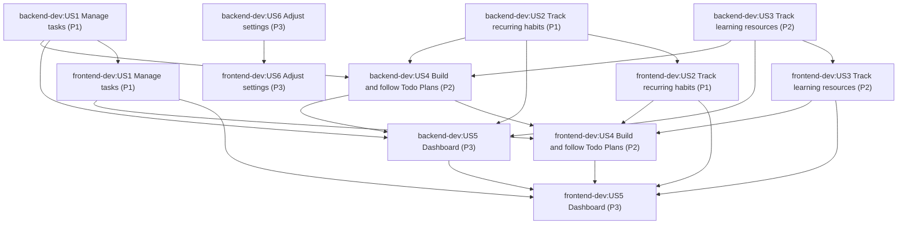

# Orchestration plan: 001-quickflow

Sources: `project.config.yaml` (layers `backend` → loop `backend-dev`; `frontend` → loop `frontend-dev`,
`contract_from: backend`), and `loops/{backend-dev,frontend-dev}/state/001-quickflow/{requirements,phases}.json`.
Nodes are the stories that have a phase in each loop's `phases.json` (US1–US6 in both loops).
Edges are each story's `depends_on` (same loop) plus `backend-dev:USn → frontend-dev:USn` (contract).

## Dependency graph

## Order

Topological order; ties broken by priority (P1 first), then story id, then the contract layer (backend) first.

| # | Loop | Story | Goal | Priority |
|---|------|-------|------|----------|
| 1 | backend-dev | US1 | Manage tasks | P1 |
| 2 | frontend-dev | US1 | Manage tasks | P1 |
| 3 | backend-dev | US2 | Track recurring habits | P1 |
| 4 | frontend-dev | US2 | Track recurring habits | P1 |
| 5 | backend-dev | US3 | Track learning resources with milestones and notes | P2 |
| 6 | frontend-dev | US3 | Track learning resources with milestones and notes | P2 |
| 7 | backend-dev | US4 | Build and follow Todo Plans | P2 |
| 8 | frontend-dev | US4 | Build and follow Todo Plans | P2 |
| 9 | backend-dev | US5 | See everything on the Dashboard | P3 |
| 10 | frontend-dev | US5 | See everything on the Dashboard | P3 |
| 11 | backend-dev | US6 | Adjust settings | P3 |
| 12 | frontend-dev | US6 | Adjust settings | P3 |
