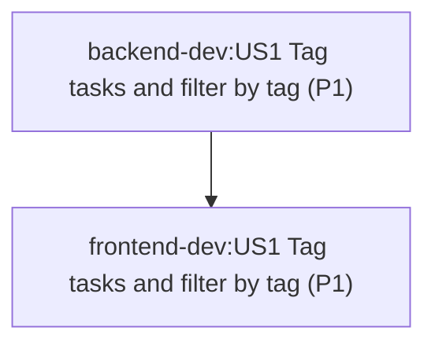

# Orchestration plan: 002-us-tags

Sources: `project.config.yaml` (layers `backend` → loop `backend-dev`; `frontend` → loop `frontend-dev`,
`contract_from: backend`), and `loops/{backend-dev,frontend-dev}/state/002-us-tags/{requirements,phases}.json`.
Nodes are the stories that have a phase in each loop's `phases.json` (US1 in both loops).
Edges are each story's `depends_on` (same loop; empty for US1) plus `backend-dev:US1 → frontend-dev:US1`
(contract; also listed in `frontend-dev` phase-01 `depends_on`).

## Dependency graph

## Order

| # | Loop | Story | Goal |
|---|------|-------|------|
| 1 | backend-dev | US1 | Tag tasks and filter by tag |
| 2 | frontend-dev | US1 | Tag tasks and filter by tag |
